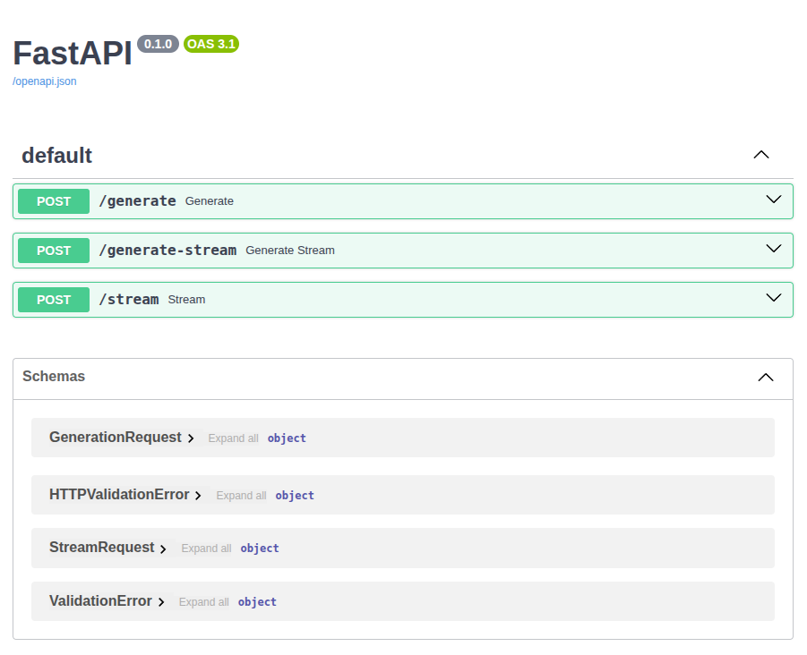
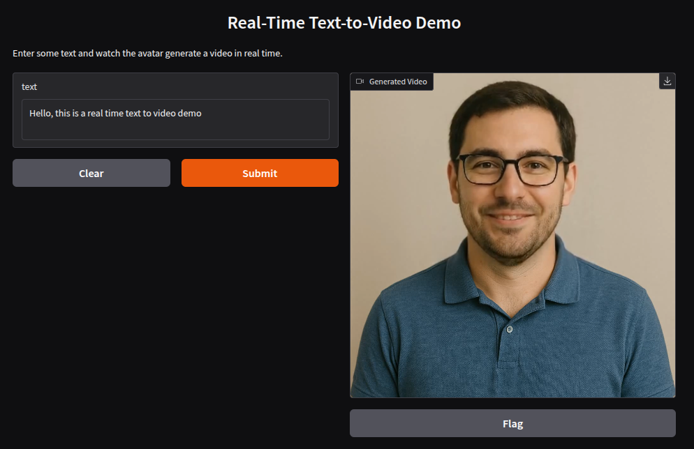
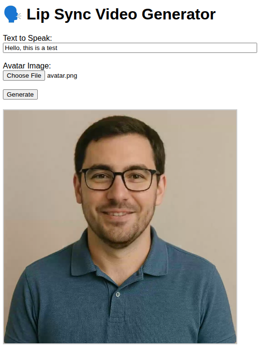

# 🗣️ TalkingFace — End-to-End Talking Head Generation Pipeline

Welcome to **TalkingFace**, an end-to-end pipeline designed for generating realistic talking head videos from text or audio inputs.

This project supports using [SadTalker](https://github.com/OpenTalker/SadTalker) for high-quality video generation, combined with [Parler TTS](https://github.com/huggingface/parler-tts) for natural and expressive text-to-speech synthesis. It also features:

- ⚡ TensorRT model export for lightning-fast inference  
- 🧵 Multithreaded seamless cloning to keep the pipeline smooth and efficient  
- 🚀 API implementation with Ray Serve for easy scaling and deployment  

Whether you want to convert text into talking avatars or bring portraits to life with synced speech, **TalkingFace** makes the entire process streamlined and accessible.

---

## 💾 Download models
Run the following script to automatically download all the models:
```bash
bash scripts/download_models.sh
```

---

## 🚀 Run the Application

**Prerequisites:**
Ensure that the following are properly installed and configured:

* [Docker](https://www.docker.com/)
* [NVIDIA Container Toolkit](https://docs.nvidia.com/datacenter/cloud-native/container-toolkit/overview.html) (for GPU support)

---

To start the application, run:

```bash
bash scripts/dev.sh
```

This will launch a **FastAPI** server on port **8091**.

### 🔍 Additional Interfaces

* **Ray Dashboard**: [http://localhost:8625](http://localhost:8625)
  Monitor and manage distributed tasks and resources.

* **Grafana Logs**: [http://localhost:3000](http://localhost:3000)
  Visualize metrics and logs.

* **FastAPI documents** [http://localhost:8091/docs](http://localhost:8091/docs) Swagger UI:

<p align="center">
  
</p>
---

## 🧪 Test the Video Generation Service

After running the application, you can verify that the service is working correctly by generating a sample video.

### ✅ Option 1: Launch the Gradio Demo

Run the following command to start the Gradio-based interface:

```bash
python app/gradio_demo.py
```

Then open your browser and navigate to:
👉 [http://localhost:7680](http://localhost:7680)

<p align="center">
  
</p>

---

### ✅ Option 2: Launch the WebRTC App

Run the following command to start the WebRTC-based frontend:

```bash
python app/fe_app.py
```

Then open your browser and navigate to:
👉 [http://localhost:3003](http://localhost:3003)

<p align="center">
  
</p>

---

### ✅ Option 3: Test via `curl`

If you prefer using `curl`, you can encode the image manually and run:

```bash
curl -X POST http://0.0.0.0:8091/generate \
  -H "Content-Type: application/json" \
  -d '{
    "text": "Hello, this is a test of real-time video generation.",
    "speaker_id": "random",
    "image_bytes": "<base64-encoded-avatar.png>"
  }' --output output_video.mp4
```

> Replace `<base64-encoded-avatar.png>` with the base64 string of your image file (e.g., using `base64 examples/avatar.png` in Unix systems).

---

## Export the Generator to TensorRT (Optional)

1. Export to ONNX

```bash
python tensorrt/to_onnx.py
```

2. Export to ONNX graphsurgeon
```bash
python tensorrt/to_onnx_gs.py
```

3. Compile the Grid Sample 3D
```bash
cd tensorrt/plugin
mkdir build && cd build
cmake .. -DTensorRT_ROOT=/your/local/path/to/tensorrt
make
```

4. Export to TensorRT engine
```bash
sh to_trt.sh
```

This will generate a `model.engine` file optimized for fast inference. Modify the `use_trt`  to True.

---

## 🤝 Acknowledgements

Big shoutout to the amazing developers of [SadTalker](https://github.com/OpenTalker/SadTalker) for their inspiring open-source work — this project is built on their solid foundation.

Thanks also to the [Parler TTS](https://github.com/huggingface/parler-tts) team at Huggingface for their excellent text-to-speech module integration.

Special thanks to the blog post on [Zhihu](https://zhuanlan.zhihu.com/p/675551997) for the detailed instructions and insights into TensorRT implementation, and to [grid-sample3d-trt-plugin](https://github.com/SeanWangJS/grid-sample3d-trt-plugin) by SeanWangJS for the 3D grid sample TensorRT plugin.
